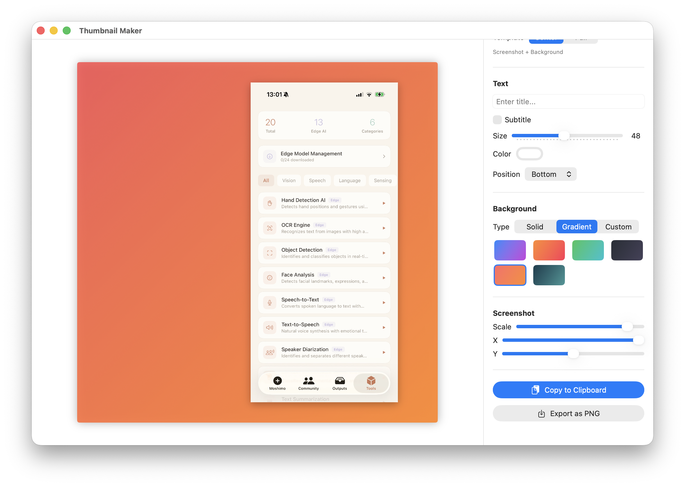

# Thumbnail Maker

iPhone screenshots from social media thumbnails in seconds. Native SwiftUI app for macOS and iOS.



## Features

- **Paste & Go** - Cmd+V to paste iPhone screenshots (Universal Clipboard supported)
- **Platform Presets** - X (1080x1080), note.com (1280x670), LinkedIn (1200x627)
- **2 Template Styles**
  - **Center** - Screenshot centered on gradient/solid background with text
  - **Full** - Screenshot fills canvas with semi-transparent overlay and text
- **Text Overlay** - Title & subtitle with 9-position placement grid, adjustable size and color
- **Background** - 6 gradient presets, solid color, or custom gradient with angle control
- **iPhone Corner Radius** - Matches the real iPhone display curvature
- **Screenshot Positioning** - Scale, X/Y offset sliders for precise placement
- **Video → GIF** - Drag & drop screen recordings (MP4/MOV) to create animated GIF thumbnails
- **Video Preview** - Inline looping video playback in the canvas
- **GIF Settings** - Adjustable FPS (5-15) and max duration (1-10s)
- **One-Click Export** - Copy to clipboard, save as PNG, or export as animated GIF
- **iOS Support** - PhotosPicker integration and Share Sheet

## Requirements

- macOS 14.0+ (Sonoma) or iOS 17+
- Swift 5.10+

## Build & Run

```bash
# Build and create .app bundle
./build.sh

# Run
open ThumbnailMaker.app
```

## Install to Applications

```bash
cp -r ThumbnailMaker.app /Applications/
```

## Usage

### Image Thumbnail

1. Copy a screenshot on your iPhone (or any image to clipboard)
2. Open Thumbnail Maker
3. **Cmd+V** to paste (macOS) or tap the photo button (iOS)
4. Select platform (X / note / LinkedIn)
5. Choose template style (Center or Full)
6. Add title text, adjust position and styling
7. **Copy to Clipboard** or **Export as PNG**

### Animated GIF from Video

1. Drag & drop a screen recording (MP4/MOV) onto the canvas
2. Video plays inline as a preview — adjust template, text, and background as usual
3. Tune GIF settings in the sidebar (FPS, max duration)
4. Click **Export as GIF** — frames are rendered with your template applied

## Keyboard Shortcuts (macOS)

| Shortcut | Action |
|----------|--------|
| Cmd+V | Paste image from clipboard |
| Cmd+C | Copy rendered thumbnail to clipboard |

## Project Structure

```
Sources/
├── ThumbnailMakerApp.swift     # App entry point
├── PlatformTypes.swift          # Cross-platform type aliases
├── Models/
│   ├── Platform.swift           # Platform presets & sizes
│   ├── TemplateStyle.swift      # Center / Full templates
│   ├── TextConfiguration.swift  # Text settings + 9-position enum
│   ├── BackgroundConfiguration.swift  # Background settings
│   └── ThumbnailProject.swift   # Central observable model
├── Views/
│   ├── ContentView.swift        # Root layout (macOS: split, iOS: vertical)
│   ├── Canvas/
│   │   ├── ThumbnailCanvasView.swift  # Renders the thumbnail
│   │   ├── CanvasPreviewView.swift    # Preview wrapper + drag/paste
│   │   ├── VideoPlayerView.swift      # Looping AVPlayer for video preview
│   │   └── DropZoneView.swift         # Empty state
│   ├── Sidebar/
│   │   ├── SidebarView.swift          # All controls container
│   │   ├── PlatformPicker.swift
│   │   ├── TemplatePicker.swift
│   │   ├── TextControls.swift         # Text + 3x3 position grid
│   │   ├── BackgroundControls.swift
│   │   └── ExportControls.swift
│   └── Shared/
│       └── GradientPresetView.swift
└── Services/
    ├── ClipboardService.swift     # NSPasteboard / UIPasteboard
    ├── ImageRenderService.swift   # SwiftUI → image rendering
    ├── ExportService.swift        # PNG file export (macOS)
    ├── VideoFrameExtractor.swift  # AVFoundation frame extraction
    └── GIFExportService.swift     # Animated GIF generation (ImageIO)
```

## iOS

Open `Package.swift` in Xcode, select an iOS simulator or device, and run.

## License

MIT
